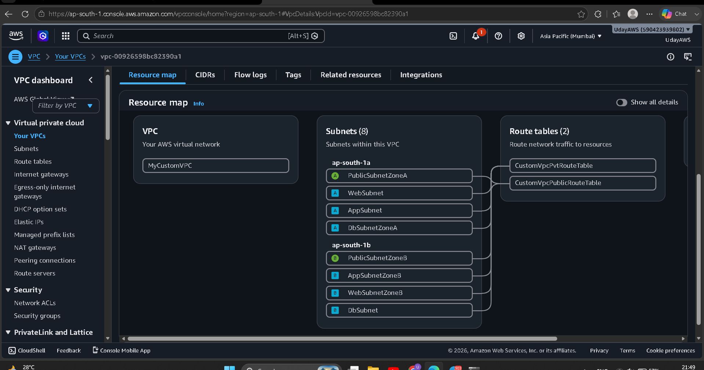
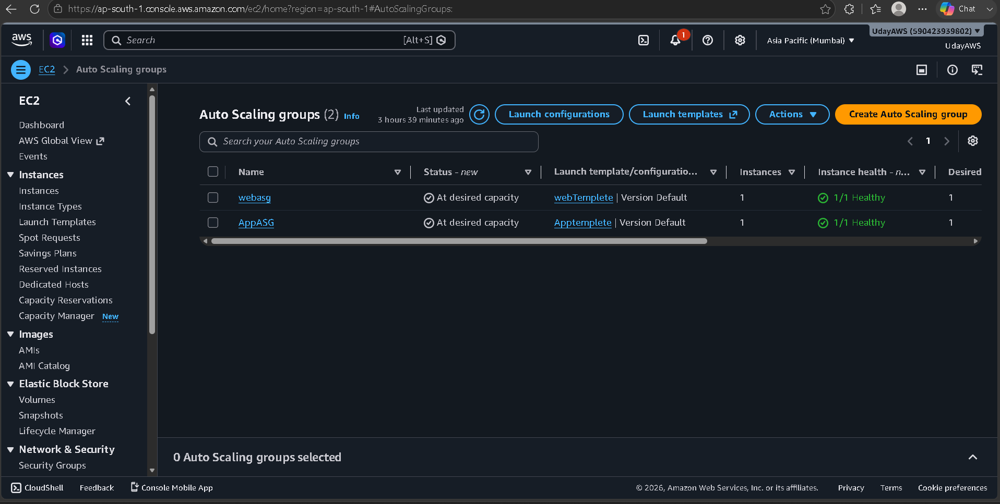
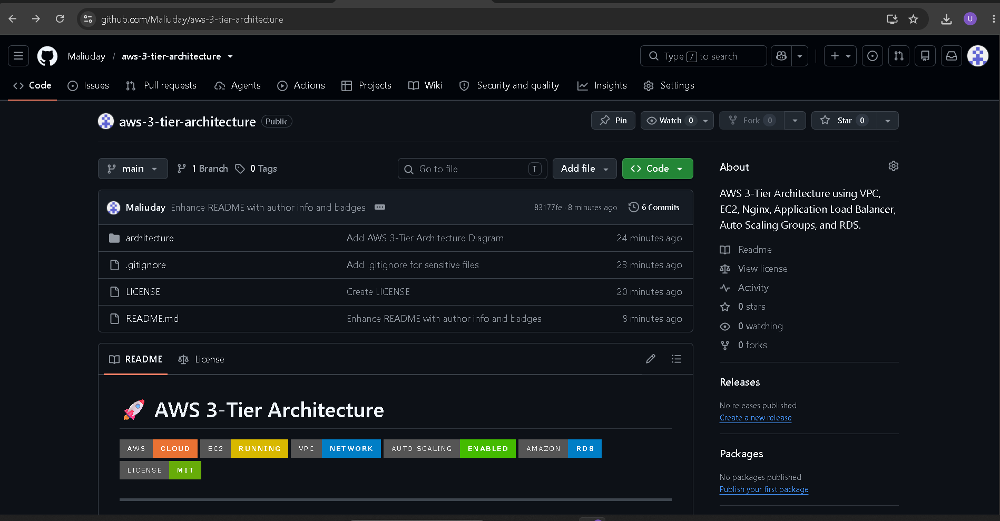

# 🚀 AWS 3-Tier Architecture on AWS


---

# 📌 Project Overview

This project demonstrates the implementation of a secure, scalable, and highly available **AWS 3-Tier Architecture** using core AWS networking and compute services.

The infrastructure is designed following AWS best practices with isolated networking, high availability, load balancing, and auto scaling.

### Architecture Layers

- 🌐 Web Tier
- ⚙️ Application Tier
- 🗄️ Database Tier

---

# 🏗 Architecture Diagram

```
                     Internet
                         │
                         ▼
           Internet Facing Application Load Balancer
                         │
          ┌──────────────┴──────────────┐
          ▼                             ▼
      Web Server 1                 Web Server 2
         (ASG)                        (ASG)
              │
              ▼
          Internal Load Balancer
              │
      ┌───────┴────────┐
      ▼                ▼
 App Server 1      App Server 2
     (ASG)             (ASG)
          │
          ▼
     Amazon RDS (MySQL)
```

---

# 📸 Project Screenshots

## 🖥️ VPC Resource Map



---

## ⚙️ Auto Scaling Groups



---

## 📂 GitHub Repository



---

# ☁️ AWS Services Used

- Amazon VPC
- Public Subnets
- Private Subnets
- Internet Gateway
- NAT Gateway
- Route Tables
- Security Groups
- EC2
- Nginx
- Application Load Balancer (ALB)
- Internal Application Load Balancer
- Auto Scaling Groups
- Amazon RDS (MySQL)

---

# 🧩 Infrastructure Components

| Layer | AWS Service |
|--------|-------------|
| Networking | Amazon VPC |
| Web Tier | EC2 + Nginx |
| Load Balancer | Application Load Balancer |
| Application Tier | EC2 |
| Database Tier | Amazon RDS |
| Scaling | Auto Scaling Groups |
| Security | Security Groups |

---

# 🔐 Security Implementation

- Public & Private Subnets
- Public Route Table
- Private Route Table
- Internet Gateway
- NAT Gateway
- Security Groups
- Private Application Servers
- Private Database
- Multi-AZ Deployment

---

# 📈 High Availability Features

- Multi Availability Zone Deployment
- Internet Facing Load Balancer
- Internal Load Balancer
- Auto Scaling Groups
- Fault Tolerant Design
- Scalable Infrastructure

---

# 🔄 Request Flow

```
Client
   │
   ▼
Internet
   │
   ▼
Application Load Balancer
   │
   ▼
Web Servers (ASG)
   │
   ▼
Internal Load Balancer
   │
   ▼
Application Servers (ASG)
   │
   ▼
Amazon RDS
```

---

# ⚙️ Deployment Steps

- Create Custom VPC
- Create Public & Private Subnets
- Configure Internet Gateway
- Configure NAT Gateway
- Configure Route Tables
- Launch EC2 Instances
- Install and Configure Nginx
- Configure Security Groups
- Create Target Groups
- Configure Application Load Balancers
- Configure Auto Scaling Groups
- Launch Amazon RDS Database
- Test End-to-End Connectivity

---

# 📂 Repository Structure

```
aws-3-tier-architecture/
│
├── architecture/
│   ├── architecture-diagram.md
│   ├── auto-scaling-group.png
│   ├── github-repository.png
│   └── vpc-resource-map.png
│
├── README.md
├── LICENSE
└── .gitignore
```

---

# 📚 Learning Outcomes

- AWS Networking
- Amazon VPC
- Public & Private Subnets
- Route Tables
- Internet Gateway
- NAT Gateway
- EC2 Deployment
- Nginx Configuration
- Application Load Balancer
- Internal Load Balancer
- Auto Scaling Groups
- Amazon RDS
- High Availability
- Infrastructure Design
- AWS Security Best Practices

---

# 💰 Cost Optimization

To avoid unnecessary AWS charges after completing the project, the following resources were removed:

- EC2 Instances
- Application Load Balancers
- Auto Scaling Groups
- NAT Gateway

This project is retained through documentation and architecture screenshots.

---

# 🚀 Future Improvements

- Infrastructure as Code using Terraform
- CI/CD Pipeline with GitHub Actions
- CloudWatch Monitoring
- CloudTrail Logging
- AWS WAF Integration
- Route 53 Domain Configuration
- SSL using AWS Certificate Manager

---

# 👨‍💻 Author

## Uday Mali

🎓 MCA Student  
☁️ AWS & DevOps Enthusiast  
💻 Passionate about Cloud Infrastructure & Automation

---

## 🤝 Connect With Me

### GitHub

https://github.com/Maliuday

### LinkedIn

https://www.linkedin.com/in/uday-mali-7aa1b7286/

---

## ⭐ Support

If you found this repository useful, please consider giving it a **Star ⭐**.

Your support motivates me to build more real-world AWS & DevOps projects and share my learning with the community.

---

# 📄 License

This project is licensed under the **MIT License**.

---

# 🙌 Thank You

Thank you for visiting this repository.

Happy Learning! 🚀
